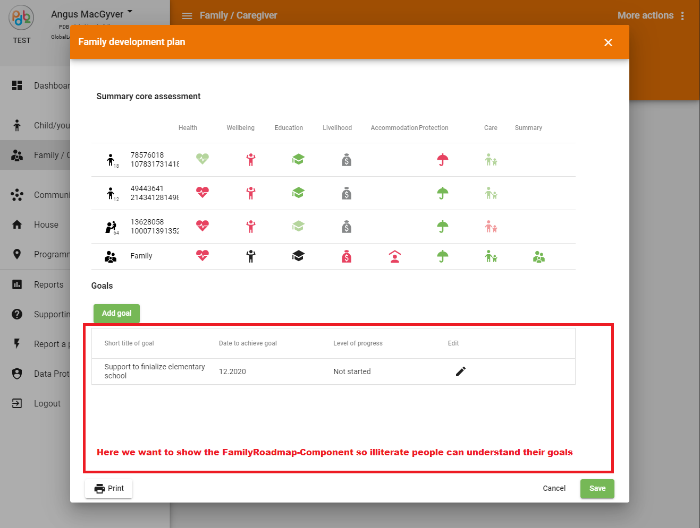
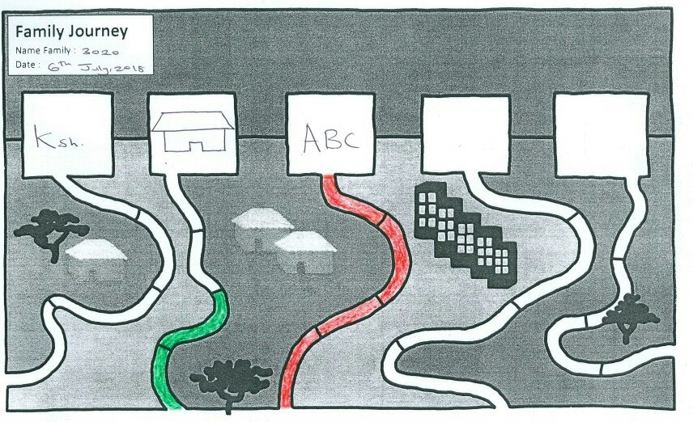
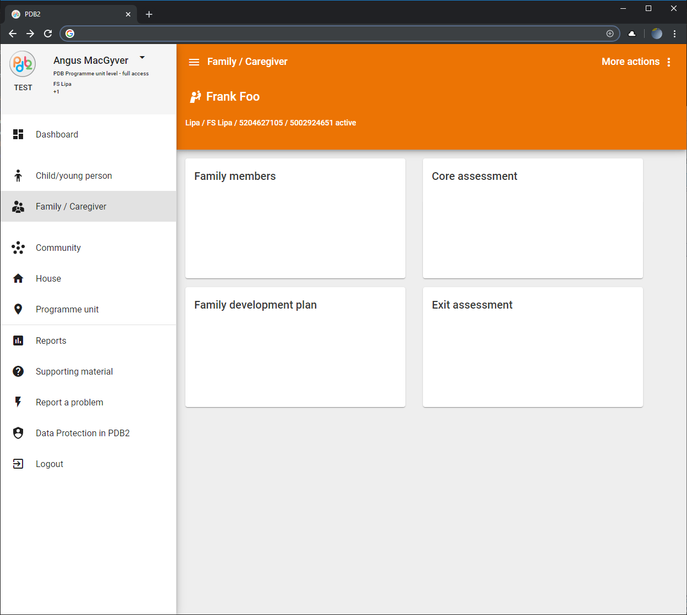

# HackXmas2019
Resources for the HackXmas-Hackathon in Copenhagen

https://hackxmas2019.web.app/

stay tuned for more details!

## About SOS Children's Villages
We are a global federation working to protect and care for children who have lost parental care, or who stand at risk of losing it.

- [Who we are](https://www.sos-childrensvillages.org/who-we-are) 
- [Our work](https://www.sos-childrensvillages.org/our-work)
    for this Project you should be familiar with these areas of our work:
    - Strengthen families
        - We help families that experience crises or extreme hardship so they can stay together.
        - https://www.sos-childrensvillages.org/our-work/quality-care/strengthen-families
    - Alternative care
        - We work to provide quality alternative care for children who can no longer live with their parents.
        - https://www.sos-childrensvillages.org/our-work/quality-care/alternative-care

- [Our history](https://www.sos-childrensvillages.org/who-we-are/history) (founded 70 years before)
- [Where we help](https://www.sos-childrensvillages.org/where-we-help) (in 136 countries around the world)

watch the Video: https://youtu.be/4mct0uW6zsg

### About this Repository
[Our organization](https://www.sos-childrensvillages.org/organisation) is a federation of 118 national SOS Children's Villages associations. This Repository is maintained by developers from the umbrella organization: [SOS Children's Villages International](https://www.sos-childrensvillages.org/).

### What we have built so far internally
We have built and rolled out an [Angular](https://angular.io/) Application called PDB which stands for Programme Database. It is used by more than 5,000 of our social workers in more than 100 countries and territories and therefore it was translated into 37 languages. It's mainly used on Windows-PCs but we are currently inviting users to run it on their Tablets and Android Phones.

We have added some offline-capabilites based on [service worker](https://angular.io/guide/service-worker-getting-started) and indexed-db because some of our socialworkers work in places where the internet has not arrived yet.

The App supports social worker at her/his daily work. On field-trips (s)he would use it to assess the risks and challenges a family is facing and make a plan how to support the family. Later the App should help the social worker and the family to measure their progress and implement the plan.

Unfortunately, we cannot publish the sourcecode of PDB in here, but that's how it looks like:

(You'll find more screenshots and pictures in /documentation)

## How you can help

Due to limited resources we had to focus on implementing the most needed business-requirements first. We had no time for "nice to have"-features that make the application more appealing to it's users.

We would appreciate your creative input in the form of
- Angular Components or WebComponents
    - a Component that looks like this:  so we can show a family's goals and progress to illiterate family-members.
    Every icon on the top represents a Goal defined in the "Family development plan" and the coloured "street" the level of implementation.
    - help us making our empty Cards on the Family-Screen less empty:  How could we visualize a family? How could we dynamically render Avatars based on age, gender, personal issues?
    
- Come up with Creative inputs that make a social worker's life easier!
    - brainstorm and contribute wireframes or screenflows
    - contribute with prototypes (Angular, Typescript)
        - Think of maps where the families are located and scheduled tasks are due
        - reminders/toasts
        - a social-workers daily/upcoming tasks or field trips,...
    - wireframes for new features that help social workers to collect data?!
